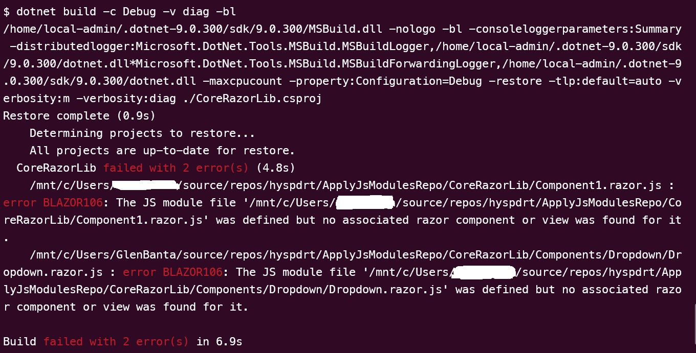

# RCL with TypeScript Collocated JS Modules

When building a Razor Class Library that leverages Collocated JS Modules that are built from TypeScript, and built on a Linux machine, end up with a relative path that is actually mostly the absolute path (minus the initial /).

This indirectly causes the _ApplyJsModules_ task to not find the related '.razor' file, as it looks for an exact match minus the '.js' extension which in turn throws the BLAZOR106 error.

This repo includes a clone of the _ApplyJsModules_ task that can be used to also see the faulted value.

You can also output the list of files via a `<Target />` in your csproj with `Content->Distinct()` and witness the bad paths for only the collocated Js Module files.

**To be clear:** this is _NOT_ an error with the ApplyJsModule task.

See: _Microsoft.NET.Sdk.StaticWebAssets.JSModules.targets_

On line: 408, the `_JSFileModuleCandidates Include="@(Content->Distinct())"` Content already has the corrupt file paths

```xml
  <!-- JS file modules -->
  <Target Name="ResolveJSModuleStaticWebAssets" DependsOnTargets="ResolveProjectStaticWebAssets;ResolveRazorComponentInputs;ResolveRazorGenerateInputs">

    <ItemGroup>
      <!-- To avoid situations where the content is defined twice, if the user defines the JS module explicitly as
           a content item, we'll prefer that over the potential item in the None item group
      -->
      <_JSFileModuleCandidates Include="@(Content->Distinct())" />
      <_JSFileModuleNoneCandidates Include="@(None->Distinct())" Exclude="@(Content)" />
      <_JSFileModuleCandidates Include="@(_JSFileModuleNoneCandidates)" />
    </ItemGroup>
```

## To see the errors in an acutal build...

Clone this repository to a linux machine or Windows (and use WSL Ubuntu).

Then navigate to the root of the CoreRazorLib project folder and run the below commands:

- dotnet clean
- rm -rf bin/ obj/
- dotnet restore
- dotnet build

You will get 2 BLAZOR106 errors



## To temporarily work around the issue

Paste the below target into the csproj file.

Just before the 'GetTargetPathWithTargetPlatformMoniker' Target, we brute force the paths back to relative paths - then the build completes as expected without error.

```xml
<!-- SDK 9.0.300 Broken with WASM Standalone Razor JS Modules -->
	<Target Name="NormalizeContentPathsForLinux" BeforeTargets="GetTargetPathWithTargetPlatformMoniker">

		<Message Importance="high" Text="Building on Linux!" Condition="$([MSBuild]::IsOSPlatform('Linux'))" />

		<PropertyGroup>
			<ProjectFullPath>$([System.IO.Path]::GetFullPath('$(MSBuildProjectDirectory)'))</ProjectFullPath>
		</PropertyGroup>

		<!-- Save Content items with absolute paths for normalization -->
		<ItemGroup>
			<_ContentWithAbsolutePaths Include="@(Content)" Condition="$([System.String]::Copy('%(Identity)').StartsWith('/'))">
				<OriginalIdentity>%(Identity)</OriginalIdentity>
				<NormalizedPath>$([MSBuild]::MakeRelative($(ProjectFullPath), '%(FullPath)'))</NormalizedPath>
			</_ContentWithAbsolutePaths>
		</ItemGroup>

		<!-- Log before modification -->
		<Message Importance="normal" Text="Found @(_ContentWithAbsolutePaths->Count()) Content items with absolute paths to normalize" />

		<!-- Remove the items with absolute paths -->
		<ItemGroup Condition="$([MSBuild]::IsOSPlatform('Linux'))">
			<Content Remove="@(_ContentWithAbsolutePaths->'%(OriginalIdentity)')" />
		</ItemGroup>

		<!-- Add them back with normalized paths -->
		<ItemGroup Condition="$([MSBuild]::IsOSPlatform('Linux'))">
			<Content Include="@(_ContentWithAbsolutePaths->'%(NormalizedPath)')" />
		</ItemGroup>

		<!-- Log after modification -->
		<Message Importance="normal" Text="Normalized paths for Content items on Linux" Condition="$([MSBuild]::IsOSPlatform('Linux'))" />
		
	</Target>
```